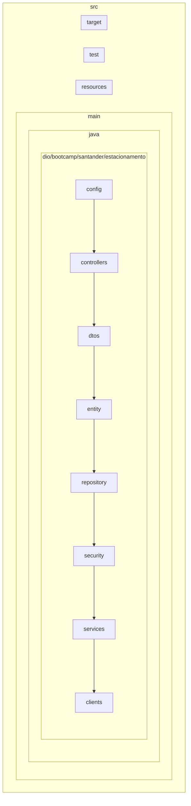

# Estacionamento

Classe User

A classe User representa um usuário no sistema de gerenciamento de estacionamento. Ela é mapeada para a tabela "users" no banco de dados.
Atributos

    id (Long): Identificador único do usuário no banco de dados.
    username (String): Nome de usuário do usuário.
    password (String): Senha do usuário.
    roles (List<String>): Lista de funções (roles) do usuário.

Relacionamentos

    A classe User possui um relacionamento com a classe Vehicle através da lista de veículos do usuário.

Construtores

    User(): Construtor padrão vazio.
    User(String username, String password): Construtor que recebe o nome de usuário e a senha como parâmetros.

Notas

    A classe User utiliza o projeto Lombok para geração automática de getters e setters.

Lembre-se de atualizar o README com mais detalhes sobre essa classe ou adicionar informações adicionais, se necessário. Quando estiver pronto para continuar com a próxima classe, por favor, forneça os detalhes.

Classe Vehicle

A classe Vehicle representa um veículo registrado no sistema de gerenciamento de estacionamento. Ela é mapeada para o banco de dados e está relacionada a um usuário.
Atributos

    id (Long): Identificador único do veículo no banco de dados.
    plateNumber (String): Número da placa do veículo.
    brand (String): Marca do veículo.
    user (User): Usuário ao qual o veículo está associado.

Relacionamentos

    A classe Vehicle possui um relacionamento com a classe User através do atributo user. Cada veículo está associado a um usuário.

Construtores

    Vehicle(): Construtor padrão vazio.
    Vehicle(String plateNumber, String brand, User user): Construtor que recebe o número da placa, a marca e o usuário associado como parâmetros.

Lembre-se de atualizar o README com mais detalhes sobre essa classe ou adicionar informações adicionais, se necessário. Quando estiver pronto para continuar com a próxima classe, por favor, forneça os detalhes.

Classe ParkingInfo

A classe ParkingInfo representa as informações relacionadas ao estacionamento de um veículo, incluindo o horário de entrada, o horário de saída e o custo do estacionamento. Essas informações são registradas no sistema de gerenciamento de estacionamento e estão associadas a um veículo específico.
Atributos

    id (Long): Identificador único das informações de estacionamento no banco de dados.
    checkInTime (LocalDateTime): Data e hora de entrada do veículo no estacionamento.
    checkOutTime (LocalDateTime): Data e hora de saída do veículo do estacionamento.
    cost (double): Custo do estacionamento.
    vehicle (Vehicle): O veículo associado a estas informações de estacionamento.

Relacionamentos

    A classe ParkingInfo possui um relacionamento com a classe Vehicle através do atributo vehicle. Isso permite vincular as informações de estacionamento a um veículo específico.

Construtores

    ParkingInfo(): Construtor padrão vazio.
    ParkingInfo(LocalDateTime checkInTime, LocalDateTime checkOutTime, double cost, Vehicle vehicle): Construtor que recebe a data e hora de entrada, a data e hora de saída, o custo e o veículo associado como parâmetros.

Este é um componente essencial do sistema de gerenciamento de estacionamento, pois registra e rastreia as informações relacionadas ao estacionamento dos veículos. Lembre-se de atualizar o README com mais detalhes sobre essa classe ou adicionar informações adicionais, se necessário. Quando estiver pronto para continuar com a próxima classe, por favor, forneça os detalhes.

Classe LoginController

A classe LoginController é responsável por fornecer endpoints para autenticação de usuários e geração de tokens JWT (JSON Web Token) após a autenticação bem-sucedida. Ela desempenha um papel fundamental na segurança do sistema de gerenciamento de estacionamento, permitindo que os usuários acessem recursos protegidos com base em autenticação.
Métodos e Endpoints

    logar(@RequestBody Login login): Este método é mapeado para a rota /login e permite que os usuários façam login no sistema. Ele recebe um objeto Login contendo o nome de usuário (username) e senha (password) fornecidos pelo cliente.
        O método verifica se o nome de usuário é válido e se a senha corresponde ao usuário no banco de dados.
        Se a autenticação for bem-sucedida, um token JWT é gerado para o usuário, que contém informações sobre a sessão e as funções do usuário.
        Caso contrário, se a autenticação falhar, uma exceção é lançada indicando uma "Senha inválida" ou "Erro ao tentar fazer login", dependendo da situação.

Dependências

    PasswordEncoder: É usado para criptografar e verificar senhas.
    SecurityConfig: Contém informações de configuração de segurança, como a chave JWT.
    UserRepository: Fornecerá acesso ao banco de dados para buscar informações do usuário.
    JWTCreator: É usado para criar o token JWT.

Considerações de Segurança

    O endpoint /login é responsável pela autenticação e, após a autenticação bem-sucedida, gera um token JWT que pode ser usado para autorizar o acesso a recursos protegidos. Isso ajuda a garantir que apenas usuários autenticados tenham acesso a esses recursos.

Esta classe desempenha um papel importante na segurança do sistema e na autenticação de usuários. Certifique-se de incluir todas as informações necessárias no README e de documentar as rotas, parâmetros esperados e o comportamento esperado durante a autenticação. Quando estiver pronto para continuar com a próxima classe, por favor, forneça os detalhes.

Classe ParkingController

A classe ParkingController é responsável por fornecer endpoints relacionados ao cálculo do custo de estacionamento com base na localização e duração da estadia. Isso permite que os usuários obtenham estimativas de custos antes de estacionar em um local específico.
Métodos e Endpoints

    calculateParkingCost(@RequestParam String location, @RequestParam double duration): Este método é mapeado para a rota /parking/calculateCost e permite aos usuários calcular o custo de estacionamento com base na localização e duração da estadia.
        Recebe dois parâmetros via consulta: location, que é uma string representando a localização de estacionamento, e duration, que é um número decimal representando a duração da estadia em horas.
        O método delega o cálculo do custo ao serviço ParkingService e retorna o valor calculado como um número decimal.

Dependências

    ParkingService: É injetado na classe ParkingController para realizar o cálculo do custo de estacionamento. Certifique-se de que o serviço esteja adequadamente implementado e documentado para garantir um funcionamento correto deste controlador.

Uso

    Os clientes podem acessar o endpoint /parking/calculateCost fornecendo os parâmetros location e duration para calcular o custo de estacionamento com base em sua localização e duração de estadia.

    Certifique-se de incluir informações detalhadas no README sobre como os parâmetros são tratados, como o cálculo do custo é realizado e como os resultados são retornados.

Este controlador fornece uma funcionalidade útil para os usuários calcularem o custo de estacionamento com base em critérios específicos. Documentar os parâmetros esperados e o comportamento esperado do método é essencial para garantir a compreensão e uso adequado por parte dos desenvolvedores e clientes. Quando estiver pronto para continuar com a próxima classe, por favor, forneça os detalhes.

Classe PublicController

A classe PublicController é responsável por fornecer endpoints públicos que permitem que os usuários acessem informações públicas, criem novos usuários, recuperem informações de usuários existentes, atualizem informações de usuários e excluam usuários.
Métodos e Endpoints

    publicInfo(): Este método é mapeado para a rota /api/public/info e retorna uma mensagem simples indicando que este é um endpoint público.

    createUser(@RequestBody User user): Este método é mapeado para a rota /api/public/users/create e permite a criação de um novo usuário.
        Recebe um objeto User no corpo da solicitação com informações do novo usuário, como nome de usuário e senha.
        Chama o serviço UserService para criar o usuário e retornar uma resposta com o resultado da operação.

    getAllUsers(): Este método é mapeado para a rota /api/public/users e permite recuperar uma lista de todos os usuários.
        Chama o serviço UserService para obter a lista de usuários e retorna a lista como uma resposta.

    getUser(@PathVariable Long id): Este método é mapeado para a rota /api/public/users/{id} e permite recuperar informações de um usuário específico com base em seu ID.
        Recebe o ID do usuário como parte da URL.
        Chama o serviço UserService para obter informações do usuário e retorna uma resposta com os detalhes do usuário, se encontrado.

    updateUser(@PathVariable Long id, @RequestBody User updatedUser): Este método é mapeado para a rota /api/public/users/{id} e permite atualizar as informações de um usuário existente com base em seu ID.
        Recebe o ID do usuário como parte da URL e um objeto User atualizado no corpo da solicitação.
        Chama o serviço UserService para atualizar as informações do usuário e retorna uma resposta com os detalhes atualizados do usuário, se encontrado.

    deleteUser(@PathVariable Long id): Este método é mapeado para a rota /api/public/users/{id} e permite excluir um usuário existente com base em seu ID.
        Recebe o ID do usuário como parte da URL.
        Chama o serviço UserService para excluir o usuário e retorna uma resposta indicando o resultado da operação.

Dependências

    UserService: É injetado na classe PublicController para lidar com a lógica relacionada aos usuários. Certifique-se de que o serviço esteja adequadamente implementado e documentado para garantir o funcionamento correto deste controlador.

Uso

    O endpoint /api/public/info fornece informações públicas simples.

    O endpoint /api/public/users/create permite a criação de novos usuários. Certifique-se de incluir os detalhes sobre como fornecer as informações do novo usuário no corpo da solicitação.

    O endpoint /api/public/users permite recuperar uma lista de todos os usuários.

    O endpoint /api/public/users/{id} permite recuperar informações de um usuário específico com base em seu ID.

    O endpoint /api/public/users/{id} permite atualizar informações de um usuário existente com base em seu ID. Forneça detalhes sobre como fornecer as informações atualizadas no corpo da solicitação.

    O endpoint /api/public/users/{id} permite excluir um usuário existente com base em seu ID.

Certifique-se de incluir informações detalhadas no README sobre como os parâmetros são tratados, como as operações são realizadas e como os resultados são retornados. Isso ajudará os desenvolvedores a entender como usar efetivamente esses endpoints. Quando estiver pronto para continuar com a próxima classe, por favor, forneça os detalhes.

Classe UserController

A classe UserController é responsável por fornecer um endpoint que permite a criação de novos usuários no sistema.
Métodos e Endpoints

    postUser(@RequestBody User user): Este método é mapeado para a rota /users e permite a criação de um novo usuário.
        Recebe um objeto User no corpo da solicitação com informações do novo usuário, como nome de usuário e senha.
        Chama o serviço UserService para criar o usuário.

Dependências

    UserService: É injetado na classe UserController para lidar com a lógica relacionada à criação de usuários. Certifique-se de que o serviço esteja adequadamente implementado e documentado para garantir o funcionamento correto deste controlador.

Uso

    O endpoint /users permite a criação de novos usuários. Certifique-se de incluir detalhes sobre como fornecer as informações do novo usuário no corpo da solicitação. Certifique-se de documentar quais campos são obrigatórios e quais validações são realizadas durante a criação do usuário.

Isso deve ajudar os desenvolvedores a entender como criar novos usuários no sistema. Se houver mais classes a serem documentadas, por favor, forneça os detalhes.

Classe WelcomeController

A classe WelcomeController é responsável por fornecer endpoints de boas-vindas e autorização para usuários e gerentes.
Métodos e Endpoints

    welcome(): Este método é mapeado para a raiz / e fornece uma mensagem de boas-vindas.
    users(): Este método é mapeado para a rota /users e fornece uma mensagem para usuários autorizados.
    managers(): Este método é mapeado para a rota /managers e fornece uma mensagem para gerentes autorizados.

Anotações e Documentação

    A classe WelcomeController utiliza anotações do Swagger (@Operation, @ApiResponses) para documentar os endpoints. Isso é útil para gerar documentação automática da API.

Uso

    O endpoint raiz / fornece uma mensagem de boas-vindas.
    Os endpoints /users e /managers retornam mensagens diferentes para usuários e gerentes autorizados. Certifique-se de documentar como a autorização é tratada para garantir que somente os usuários ou gerentes corretos tenham acesso a esses endpoints.

Esta classe é responsável por fornecer mensagens de boas-vindas e é útil para verificar a autorização de usuários e gerentes. Certifique-se de documentar qualquer configuração adicional relacionada à segurança, se necessário.

Classe SwaggerConfig

Para acessar a documentação http://localhost:8080/v3/api-docs

A classe SwaggerConfig é responsável pela configuração do Swagger, uma poderosa ferramenta para a documentação de APIs. O Swagger fornece uma interface interativa para visualização e teste da API.
Configuração

    @Configuration: A anotação @Configuration indica que esta classe é uma classe de configuração Spring.

Método customOpenAPI()

    Este método cria uma instância de OpenAPI, que é a configuração global do Swagger.
    O método info() é usado para configurar informações gerais da API, como título, descrição e versão.
    O título, descrição e versão da API são definidos no objeto Info.
    O método termsOfService() define os termos de serviço da API. Substitua o URL pelo URL real dos termos de serviço.
    O método contact() define informações de contato para a API, incluindo o nome do contato e o email do contato. Substitua os valores com as informações de contato reais.

Uso

    A classe SwaggerConfig é uma parte fundamental da documentação da API.
    Certifique-se de que as informações gerais da API, como título, descrição e versão, sejam preenchidas corretamente no método customOpenAPI().
    Os termos de serviço e informações de contato são fornecidos como exemplos e devem ser ajustados para refletir as necessidades e detalhes específicos da sua API.

Através da classe SwaggerConfig, você configura o Swagger para documentar sua API de forma eficaz e fornecer informações detalhadas aos desenvolvedores que desejam interagir com sua API. Certifique-se de atualizar as informações com precisão e revisar a documentação gerada pelo Swagger para garantir que ela corresponda ao comportamento atual da sua API.

Classe ParkingInfoRepository

A classe ParkingInfoRepository é uma interface que estende o JpaRepository do Spring Data JPA e é usada para acessar dados no banco de dados relacionados à entidade ParkingInfo.
Anotações

    @Repository: A anotação @Repository é usada para indicar que esta interface é um componente Spring e está associada à camada de persistência de dados. Ela permite que o Spring Data JPA gere automaticamente uma implementação dessa interface em tempo de execução.

Extensão do JpaRepository

    Esta interface estende o JpaRepository do Spring Data JPA e especifica o tipo de entidade (no caso, ParkingInfo) e o tipo de identificador (no caso, Long) que está sendo gerenciado.

Uso

    A interface ParkingInfoRepository é usada para realizar operações de leitura e gravação no banco de dados relacionadas à entidade ParkingInfo.
    Como esta interface estende o JpaRepository, você pode herdar automaticamente uma variedade de métodos para realizar operações CRUD (Create, Read, Update, Delete) no banco de dados, como salvar, buscar por ID, buscar todos, excluir etc.
    Além dos métodos herdados, você também pode adicionar métodos personalizados a esta interface para executar consultas específicas ou operações de banco de dados que não são cobertas automaticamente.

Classe UserRepository

A classe UserRepository é uma interface que estende o JpaRepository do Spring Data JPA e é usada para acessar dados no banco de dados relacionados à entidade User.
Anotações

    @Repository: A anotação @Repository é usada para indicar que esta interface é um componente Spring e está associada à camada de persistência de dados. Ela permite que o Spring Data JPA gere automaticamente uma implementação dessa interface em tempo de execução.

Extensão do JpaRepository

    Esta interface estende o JpaRepository do Spring Data JPA e especifica o tipo de entidade (no caso, User) e o tipo de identificador (no caso, Long) que está sendo gerenciado.

Métodos personalizados

    Além dos métodos herdados do JpaRepository para realizar operações CRUD (Create, Read, Update, Delete), esta interface também define alguns métodos personalizados, a saber:
        Optional<User> findByUsername(String username): Esse método permite buscar um usuário com base no nome de usuário (username). Retorna um Optional de User, que pode conter o usuário encontrado ou ser vazio.
        boolean existsByUsername(String username): Esse método verifica se um usuário com um nome de usuário específico existe no banco de dados.

Uso

    A interface UserRepository é usada para realizar operações de leitura e gravação no banco de dados relacionadas à entidade User.
    Como esta interface estende o JpaRepository, você pode herdar automaticamente uma variedade de métodos para realizar operações CRUD no banco de dados, como salvar, buscar por ID, buscar todos, excluir etc.
    Além disso, os métodos personalizados definidos nesta interface podem ser usados para buscar um usuário com base no nome de usuário ou verificar a existência de um usuário com um nome de usuário específico.

Classe VehicleRepository

A classe VehicleRepository é uma interface que estende o JpaRepository do Spring Data JPA e é usada para acessar dados no banco de dados relacionados à entidade Vehicle.
Anotações

    @Repository: A anotação @Repository é usada para indicar que esta interface é um componente Spring e está associada à camada de persistência de dados. Ela permite que o Spring Data JPA gere automaticamente uma implementação dessa interface em tempo de execução.

Extensão do JpaRepository

    Esta interface estende o JpaRepository do Spring Data JPA e especifica o tipo de entidade (no caso, Vehicle) e o tipo de identificador (no caso, Long) que está sendo gerenciado.

Uso

    A interface VehicleRepository é usada para realizar operações de leitura e gravação no banco de dados relacionadas à entidade Vehicle.
    Como esta interface estende o JpaRepository, você pode herdar automaticamente uma variedade de métodos para realizar operações CRUD no banco de dados, como salvar, buscar por ID, buscar todos, excluir etc.

Classe JwtAuthenticationToken

A classe JwtAuthenticationToken é uma classe personalizada que estende a classe UsernamePasswordAuthenticationToken do Spring Security e é usada para representar tokens JWT (JSON Web Token) durante a autenticação.
Construtor

    A classe possui um construtor que aceita um objeto UserDetails e uma string que representa o token JWT.
    O construtor invoca o construtor da classe pai UsernamePasswordAuthenticationToken e passa o UserDetails, null (nenhuma senha é necessária, já que a autenticação é baseada no token JWT) e as autoridades (GrantedAuthority) associadas ao usuário.

Método getToken()

    O método getToken() permite acessar a string que representa o token JWT.

Uso

    A classe JwtAuthenticationToken é usada em conjunto com o Spring Security para representar o resultado da autenticação bem-sucedida com base em um token JWT.
    Durante o processo de autenticação, o token JWT é validado e, se for válido, um objeto JwtAuthenticationToken é criado para representar o usuário autenticado.
    Este objeto pode ser armazenado no contexto de segurança do Spring Security para fornecer autorizações e autenticações baseadas no token JWT.

Classe JWTCreator

A classe JWTCreator é responsável por criar e analisar tokens JWT (JSON Web Token) para autenticação e autorização de usuários em um sistema. Ela fornece métodos para criar tokens JWT e extrair informações de tokens existentes.
Métodos
Método create

O método create é usado para criar um token JWT. Ele aceita os seguintes parâmetros:

    prefix: O prefixo a ser adicionado ao token (por exemplo, "Bearer").
    key: A chave secreta usada para assinar o token JWT.
    jwtObject: Um objeto JWTObject que contém informações como o assunto do token, a data de emissão, a data de expiração e as funções/autorizações associadas.

O método cria o token JWT usando a biblioteca JWT da JJWT (Java JWT) e retorna o token completo, incluindo o prefixo.
Método create (sobrecarga)

Esta sobrecarga do método create é usada para analisar um token JWT existente e extrair informações dele. Ela aceita os seguintes parâmetros:

    token: O token JWT a ser analisado.
    prefix: O prefixo que precisa ser removido do token (por exemplo, "Bearer").
    key: A chave secreta usada para verificar a assinatura do token.

O método analisa o token, verifica sua validade e extrai informações relevantes, como o assunto, a data de expiração, a data de emissão e as funções/autorizações associadas. Em seguida, ele retorna um objeto JWTObject que contém essas informações.
Método checkRoles

Este método é usado para verificar e formatar as funções/autorizações associadas a um usuário. Ele aceita uma lista de funções e converte cada função para o formato "ROLE_" + função, garantindo que as funções estejam no formato correto para fins de autorização no Spring Security.

Uso

A classe JWTCreator é uma parte essencial de um sistema de autenticação baseado em tokens JWT. Ela é usada para criar tokens JWT quando os usuários fazem login e para analisar tokens quando são fornecidos em solicitações. A classe garante que os tokens sejam assinados e verificados com segurança, e permite que informações associadas aos usuários, como funções/autorizações, sejam incluídas nos tokens.

Classe JWTObject

A classe JWTObject é usada para representar as informações contidas em um token JWT (JSON Web Token). Ela fornece uma estrutura de dados para armazenar detalhes essenciais do token, como o assunto (nome de usuário), a data de criação, a data de expiração e as funções/autorizações associadas.
Campos

A classe JWTObject possui os seguintes campos:

    subject: Uma string que representa o nome de usuário associado ao token. Isso geralmente é o usuário autenticado.
    issuedAt: Um objeto Date que indica a data e a hora em que o token foi criado.
    expiration: Um objeto Date que indica a data e a hora em que o token expirará e não será mais válido.
    roles: Uma lista de strings que representa os perfis de acesso ou funções associadas ao usuário que detém o token.

Uso

A classe JWTObject é frequentemente usada em conjunto com a classe JWTCreator para criar e analisar tokens JWT. Ela permite armazenar informações relevantes no token, como o nome de usuário e as funções do usuário, e também fornece um meio de acessar essas informações ao analisar um token JWT.

Classe JwtRequestFilter

A classe JwtRequestFilter é um componente Spring que atua como um filtro para as solicitações HTTP recebidas pela aplicação. Ela desempenha um papel fundamental na autenticação e autorização usando tokens JWT (JSON Web Tokens).
Construtor

    JwtRequestFilter(UserDetailsService userDetailsService, JwtTokenProvider jwtTokenProvider): O filtro é construído com duas dependências, userDetailsService e jwtTokenProvider. O userDetailsService é usado para carregar detalhes do usuário com base no nome de usuário, enquanto o jwtTokenProvider é responsável por gerar, validar e extrair informações de tokens JWT.

Métodos

    doFilterInternal(HttpServletRequest request, HttpServletResponse response, FilterChain filterChain): Este método é chamado para cada solicitação HTTP que passa pelo filtro. Ele executa as seguintes ações:
        Resolve o token JWT da solicitação.
        Valida o token JWT.
        Obtém o nome de usuário do token.
        Carrega os detalhes do usuário com base no nome de usuário.
        Define a autenticação no contexto de segurança se todas as verificações forem bem-sucedidas.

    resolveToken(HttpServletRequest request): Este método é usado para extrair o token JWT de uma solicitação HTTP. Ele verifica o cabeçalho "Authorization" em busca do token.

    validateToken(String token, UserDetails userDetails): Este método é usado para validar um token JWT em relação aos detalhes do usuário. Ele verifica se o token é válido, não está expirado e corresponde ao usuário autenticado.

    isTokenExpired(String token): Este método verifica se um token JWT está expirado. Ele verifica a data de expiração do token em relação à data atual.

    getUsernameFromToken(String token): Este método extrai o nome de usuário de um token JWT. Normalmente, o nome de usuário é armazenado no campo "sub" (sujeito) do token.

Uso

A classe JwtRequestFilter é registrada como um filtro no contexto da aplicação Spring e é executada para cada solicitação HTTP. Ela desempenha um papel fundamental na autenticação de usuários com base nos tokens JWT. O filtro extrai, valida e atribui as informações de autenticação ao contexto de segurança, permitindo que outras partes da aplicação acessem essas informações para tomar decisões de autorização.

Classe JwtTokenProvider

A classe JwtTokenProvider é responsável por gerar, validar e extrair informações de tokens JWT (JSON Web Tokens) na aplicação. Os tokens JWT são usados para autenticação e autorização de usuários.
Atributos

    secret (String): A chave secreta usada para assinar os tokens JWT. Essa chave deve ser mantida em segredo e nunca deve ser compartilhada publicamente.

    expiration (Long): A duração de validade dos tokens JWT, em milissegundos. Após o período de validade, os tokens expiram e não são mais válidos.

Métodos

    generateToken(String username): Este método gera um novo token JWT com base no nome de usuário fornecido. Ele define o nome de usuário como a "reivindicação do assunto" (subject claim), define a data de emissão e a data de expiração do token e o assina com a chave secreta. O token gerado é retornado como uma string.

    resolveToken(HttpServletRequest request): Este método é usado para extrair o token JWT de uma solicitação HTTP, como dos cabeçalhos. Ele verifica o cabeçalho "Authorization" em busca do token. Se um token for encontrado, ele remove o prefixo "Bearer " para obter apenas o token JWT.

    validateToken(String token): Este método é usado para validar se um token JWT é válido. Ele verifica se o token possui uma assinatura válida, se ainda está dentro do período de validade e se atende a quaisquer outras verificações definidas.

    getUsernameFromToken(String token): Este método extrai o nome de usuário de um token JWT. Para fazer isso, ele verifica a assinatura do token, extrai as reivindicações (claims) do token e retorna o valor da reivindicação "subject" (sujeito), que normalmente contém o nome de usuário.

Uso

A classe JwtTokenProvider é uma parte essencial da autenticação baseada em tokens JWT na aplicação. Ela é usada para gerar tokens JWT quando os usuários fazem login, validar tokens JWT recebidos nas solicitações HTTP e extrair informações de autenticação dos tokens para permitir o acesso protegido às partes da aplicação.

A chave secreta definida no atributo secret é crítica para a segurança do sistema e deve ser mantida em segredo. Certifique-se de que essa chave seja armazenada de forma segura e não seja exposta em repositórios de código públicos ou em configurações acessíveis a usuários não autorizados.

Classe SecurityConfig

A classe SecurityConfig é responsável por configurar as políticas de segurança da aplicação. Ela define quais recursos da aplicação estão protegidos e quem tem acesso a eles. Além disso, configura a autenticação e autorização dos usuários.
Constantes

    EXPIRATION (int): Essa constante define a duração de validade dos tokens JWT em segundos. Os tokens JWT expiram após esse período de tempo. Certifique-se de definir um valor apropriado com base nos requisitos de segurança da sua aplicação.

    PREFIX (String): Essa constante define o prefixo usado para os tokens JWT. Geralmente, o prefixo "Bearer" é usado para indicar que o token JWT está no formato "Bearer token". Você pode personalizar esse prefixo de acordo com as necessidades da sua aplicação.

    KEY (String): Essa constante define a chave secreta usada para assinar os tokens JWT. A chave secreta é fundamental para a segurança da autenticação baseada em tokens JWT.

Configuração de Segurança

    O método configure(HttpSecurity http) configura as políticas de segurança da aplicação. Aqui estão algumas das configurações definidas:
        Desabilita a proteção contra CSRF (Cross-Site Request Forgery), que é desativada com .csrf().disable().
        Define permissões para recursos específicos, como o console H2, permitindo que eles sejam acessados sem autenticação: .antMatchers("/h2-console/**").permitAll().
        Permite o acesso a recursos públicos, como a criação de usuários, sem autenticação: .antMatchers("/api/public/users/create").permitAll().
        Define a autorização baseada em papéis (roles) para recursos específicos, como acessar detalhes de um usuário: .antMatchers("/api/public/users/{id}").access("hasRole('ROLE_ADMIN')").
        Permite o acesso a recursos do Swagger e da documentação da API sem autenticação: .antMatchers("/**.html", "/v2/api-docs", "/webjars/**", "/configuration/**", "/swagger-resources/**", "/swagger-ui/index.html/**", "/swagger-ui/**").permitAll().
        Exige autenticação para todos os outros recursos: .anyRequest().authenticated().
        Desabilita as opções do frame do console H2: .headers().frameOptions().disable().

    O método getKey() retorna a chave secreta usada para assinar os tokens JWT. A chave secreta é necessária para validar e gerar tokens JWT.

    O método passwordEncoder() retorna um objeto BCryptPasswordEncoder, que é usado para codificar senhas e verificá-las durante a autenticação.

Uso

A classe SecurityConfig é essencial para configurar as políticas de segurança da aplicação. Ela define quais recursos estão protegidos e quem tem acesso a eles. As constantes EXPIRATION, PREFIX e KEY devem ser definidas de acordo com os requisitos de segurança da aplicação.

Classe InternationalParkingCostStrategy

A classe InternationalParkingCostStrategy é uma implementação da interface ParkingCostStrategy e fornece uma estratégia de cálculo de custo de estacionamento internacional. Essa classe é usada para calcular o custo de estacionamento com base na duração e na moeda local, considerando a taxa de câmbio, se aplicável.
Atributos

    country: Representa o país para o qual o cálculo do custo de estacionamento é aplicado. O valor é injetado a partir das propriedades do aplicativo usando a anotação @Value.

    exchangeRate: Representa a taxa de câmbio a ser usada para converter o custo de estacionamento de moeda local para uma moeda internacional, como o dólar dos EUA. O valor também é injetado a partir das propriedades do aplicativo usando a anotação @Value.

Construtor

A classe InternationalParkingCostStrategy possui um construtor que recebe o país e a taxa de câmbio como argumentos e os injeta usando a anotação @Autowired. Isso permite configurar a estratégia com as informações específicas do país e da taxa de câmbio.
Método calculateParkingCost

O método calculateParkingCost é implementado a partir da interface ParkingCostStrategy. Ele calcula o custo de estacionamento com base na duração em horas e nas informações do país e da taxa de câmbio. A lógica inclui o seguinte:

    Cálculo do custo base por hora em moeda local (no exemplo, definido como 5.0).
    Verificação se o país é "USA" (Estados Unidos). Se for, a taxa de câmbio é aplicada para converter o custo para a moeda internacional.
    Retorno do custo calculado.

Uso

A classe InternationalParkingCostStrategy pode ser usada em conjunto com outras estratégias de custo de estacionamento, dependendo das necessidades do aplicativo. Ela fornece uma maneira flexível de calcular o custo de estacionamento, levando em consideração fatores internacionais, como diferentes moedas e taxas de câmbio.

Classe LocalParkingCostStrategy

A classe LocalParkingCostStrategy é uma implementação da interface ParkingCostStrategy e fornece uma estratégia de cálculo de custo de estacionamento local. Essa classe é usada para calcular o custo de estacionamento com base na duração e nas taxas locais, como taxas por hora, dia, semana, etc.
Método calculateParkingCost

O método calculateParkingCost é implementado a partir da interface ParkingCostStrategy. Ele calcula o custo de estacionamento com base na duração em horas, considerando as taxas locais. A lógica inclui o seguinte:

    Cálculo do custo de estacionamento local com base na duração.
    O custo é calculado multiplicando a taxa horária (no exemplo, definida como 10.0) pela duração em horas.
    Retorno do custo calculado.

Uso

A classe LocalParkingCostStrategy pode ser usada como uma estratégia para calcular o custo de estacionamento em cenários locais, onde as taxas podem variar com base na duração e nas taxas específicas do local. Ela fornece uma maneira flexível de calcular o custo de estacionamento com base em fatores locais.

Classe ParkingCostCalculator

A classe ParkingCostCalculator é um componente responsável por calcular o custo de estacionamento com base na duração e em uma estratégia específica. Ela é projetada para ser flexível e adaptável a diferentes estratégias de cálculo de custo.
Construtor

A classe possui um construtor que recebe uma instância da interface ParkingCostStrategy como parâmetro. Isso permite que você injete a estratégia desejada no momento da criação de um objeto ParkingCostCalculator.

java

public ParkingCostCalculator(ParkingCostStrategy costStrategy) {
    this.costStrategy = costStrategy;
}

Método calculateParkingCost

O método calculateParkingCost é responsável por calcular o custo de estacionamento com base na duração fornecida e na estratégia de cálculo escolhida. A lógica do cálculo é delegada à estratégia selecionada.

java

public double calculateParkingCost(double duration) {
    // Utilize a estratégia de cálculo de custo especificada
    return costStrategy.calculateParkingCost(duration);
}

Uso

A classe ParkingCostCalculator é útil quando você tem diferentes estratégias de cálculo de custo de estacionamento. Ela permite alternar facilmente entre essas estratégias sem modificar a lógica do cálculo.

Interface ParkingCostStrategy

A interface ParkingCostStrategy é parte do design do sistema para calcular o custo de estacionamento com base na duração. Essa interface define um contrato que todas as estratégias de cálculo de custo devem seguir.
Método calculateParkingCost

A interface ParkingCostStrategy define um único método:

java

double calculateParkingCost(double duration);

Este método recebe a duração do estacionamento como entrada e retorna o custo calculado com base na estratégia específica. Cada estratégia que implementa essa interface fornecerá uma implementação personalizada desse método para calcular o custo de acordo com suas regras.
Uso

A interface ParkingCostStrategy é fundamental para o design do sistema, pois permite criar estratégias de cálculo de custo diferentes. Cada estratégia deve implementar essa interface e fornecer sua própria lógica de cálculo.

Classe ParkingService

A classe ParkingService é responsável por calcular o custo de estacionamento com base na duração e na localização. Ela utiliza duas estratégias diferentes para calcular os custos: uma para estacionamento local e outra para estacionamento internacional.
Injeção de Dependência das Estratégias

A classe ParkingService injeta as estratégias de cálculo de custo, localCostStrategy e internationalCostStrategy, por meio da anotação @Autowired e @Qualifier. Isso permite que as estratégias sejam configuradas de forma flexível e substituídas conforme necessário.

java

@Autowired
public ParkingService(@Qualifier("localParkingCostStrategy") ParkingCostStrategy localCostStrategy,
                      @Qualifier("internationalParkingCostStrategy") ParkingCostStrategy internationalCostStrategy) {
    this.localCostStrategy = localCostStrategy;
    this.internationalCostStrategy = internationalCostStrategy;
}

Método calculateParkingCost

A classe ParkingService fornece o método calculateParkingCost, que calcula o custo de estacionamento com base na localização e na duração.

java

public double calculateParkingCost(String location, double duration) {
    // Lógica para determinar a estratégia com base na localização
    ParkingCostStrategy selectedStrategy;

    if ("local".equalsIgnoreCase(location)) {
        selectedStrategy = localCostStrategy;
    } else {
        selectedStrategy = internationalCostStrategy;
    }

    // Calcula o custo com a estratégia selecionada
    double cost = selectedStrategy.calculateParkingCost(duration);

    return cost;
}

Este método recebe a localização (que pode ser "local" ou "internacional") e a duração do estacionamento como entrada. Com base na localização, ele seleciona a estratégia apropriada (local ou internacional) e usa essa estratégia para calcular o custo. O resultado é o custo calculado com base na duração e nas regras de cálculo da estratégia selecionada.
Uso

A classe ParkingService desempenha um papel fundamental no sistema, pois coordena o cálculo do custo de estacionamento com base em diferentes estratégias. Ela permite que o sistema seja flexível e adaptável a diferentes cenários de estacionamento, onde as regras de cálculo podem variar com base na localização. As estratégias de cálculo de custo podem ser facilmente substituídas e configuradas de acordo com as necessidades do sistema.

Classe SecurityDataBaseService

A classe SecurityDataBaseService é responsável por fornecer detalhes de autenticação e autorização de usuários para o mecanismo de segurança do Spring Security. Ela implementa a interface UserDetailsService, que é parte fundamental do processo de autenticação.
Injeção de Dependência do Repositório de Usuários

A classe SecurityDataBaseService injeta o repositório de usuários (UserRepository) usando a anotação @Autowired. O repositório é usado para buscar os detalhes de um usuário com base em seu nome de usuário.

java

@Autowired
private UserRepository userRepository;

Método loadUserByUsername

A classe SecurityDataBaseService implementa o método loadUserByUsername, que é parte do contrato da interface UserDetailsService. Este método é chamado pelo Spring Security quando ele precisa carregar os detalhes de um usuário com base em seu nome de usuário.

java

@Override
@Transactional
public UserDetails loadUserByUsername(String username) {
    User userEntity = userRepository.findByUsername(username).orElse(null);
    if (userEntity == null) {
        throw new UsernameNotFoundException(username);
    }
    Set<GrantedAuthority> authorities = new HashSet<>();
    userEntity.getRoles().forEach(role -> {
        authorities.add(new SimpleGrantedAuthority("ROLE_" + role));
    });
    UserDetails user = new org.springframework.security.core.userdetails.User(userEntity.getUsername(),
            userEntity.getPassword(),
            authorities);
    return user;
}

Neste método, a classe busca os detalhes do usuário com base no nome de usuário fornecido. Se o usuário não for encontrado, é lançada uma exceção UsernameNotFoundException. Caso contrário, os papéis (roles) do usuário são mapeados para as autorizações (authorities) que o Spring Security utiliza. Por fim, os detalhes do usuário, incluindo seu nome de usuário, senha e autorizações, são encapsulados em um objeto UserDetails e retornados.
Uso

A classe SecurityDataBaseService é fundamental para o processo de autenticação e autorização do Spring Security. Ela permite que o sistema recupere os detalhes de autenticação e autorização dos usuários com base em seu nome de usuário. Esses detalhes são usados pelo Spring Security para verificar as credenciais do usuário durante o processo de autenticação e para conceder as autorizações apropriadas para acessar recursos protegidos.

Certifique-se de que esta classe esteja devidamente configurada como um serviço do Spring Security e integrada com o mecanismo de autenticação do seu aplicativo.

Classe UserService

A classe UserService é responsável por fornecer serviços relacionados aos usuários, como autenticação, criação, atualização, exclusão e recuperação de informações de usuário. Ela interage com o repositório de usuários (UserRepository) para persistir e recuperar informações de usuário no banco de dados.
Injeção de Dependência do Repositório de Usuários e do Codificador de Senha

A classe UserService injeta o repositório de usuários (UserRepository) e o codificador de senha (BCryptPasswordEncoder) usando as anotações @Autowired. O repositório é usado para acessar e persistir informações de usuário no banco de dados, enquanto o codificador de senha é usado para garantir que as senhas dos usuários sejam armazenadas de forma segura.

java

@Autowired
private final UserRepository userRepository;

@Autowired
private final BCryptPasswordEncoder passwordEncoder;

Métodos de Serviço

A classe UserService oferece diversos métodos para executar operações relacionadas aos usuários:

    findByUsername: Retorna um usuário com base no nome de usuário.
    saveUser: Salva um novo usuário no banco de dados após codificar sua senha.
    authenticate: Realiza a autenticação de um usuário comparando a senha fornecida com a senha armazenada no banco de dados.
    createUser: Cria um novo usuário com um nome de usuário e senha fornecidos, realizando a validação para garantir que o nome de usuário seja único.
    getAllUsers: Retorna a lista de todos os usuários.
    getUserById: Retorna um usuário com base no seu ID.
    deleteUser: Exclui um usuário com base no seu ID.
    updateUser: Atualiza as informações de um usuário com base no seu ID.

Uso

A classe UserService é responsável por gerenciar a lógica de negócios relacionada aos usuários do sistema. Ela é usada para criar, atualizar, excluir, autenticar e recuperar informações de usuário. Além disso, lida com a codificação e validação de senhas para garantir a segurança das informações dos usuários.

É fundamental que esta classe esteja devidamente integrada com o mecanismo de segurança (por exemplo, Spring Security) e que as operações de autenticação e autorização sejam executadas de forma segura. Certifique-se de que a classe esteja configurada e usada corretamente em seu aplicativo para garantir a segurança e a funcionalidade adequadas relacionadas aos usuários.

A classe Login é um DTO (Data Transfer Object) que é usada para representar os dados de login, geralmente vindos de uma solicitação HTTP, como uma solicitação de autenticação. Essa classe é usada para encapsular as informações de nome de usuário e senha. Aqui está a descrição da classe Login:
Classe Login

A classe Login é um DTO que representa os dados de autenticação de um usuário. Ela contém duas propriedades:

    username: Uma string que representa o nome de usuário inserido pelo usuário para autenticação.

    password: Uma string que representa a senha inserida pelo usuário para autenticação.

Métodos de Acesso (Getters e Setters)

A classe Login fornece métodos de acesso (getters e setters) para obter e definir os valores dessas propriedades:

    getUsername(): Obtém o valor do nome de usuário.

    setUsername(String username): Define o valor do nome de usuário.

    getPassword(): Obtém o valor da senha.

    setPassword(String password): Define o valor da senha.

Uso

Essa classe é usada para encapsular os dados de login fornecidos pelo usuário, geralmente em uma solicitação HTTP. Por exemplo, ao criar um endpoint de autenticação em um controlador, você pode receber uma instância de Login no corpo da solicitação e, em seguida, usar os valores do username e password para autenticar o usuário.

java

@PostMapping("/login")
public ResponseEntity<String> login(@RequestBody Login login) {
    // Obter o nome de usuário e a senha de login
    String username = login.getUsername();
    String password = login.getPassword();

    // Implementar a lógica de autenticação aqui
    // ...

    // Retornar uma resposta apropriada com base na autenticação
    // ...

    // Exemplo de retorno bem-sucedido
    return ResponseEntity.ok("Login bem-sucedido!");
}

Certifique-se de que a classe Login esteja de acordo com os requisitos de autenticação e segurança da sua aplicação, incluindo práticas recomendadas de segurança, como armazenamento seguro de senhas.

Classe Sessao

A classe Sessao é um DTO que representa informações sobre uma sessão de usuário após uma autenticação bem-sucedida. Ela contém as seguintes propriedades:

    login: Uma string que representa o nome de usuário da sessão.

    token: Uma string que representa o token de autenticação associado à sessão do usuário.

Métodos de Acesso (Getters e Setters)

A classe Sessao fornece métodos de acesso (getters e setters) para obter e definir os valores dessas propriedades:

    getLogin(): Obtém o valor do nome de usuário da sessão.

    setLogin(String login): Define o valor do nome de usuário da sessão.

    getToken(): Obtém o valor do token de autenticação associado à sessão.

    setToken(String token): Define o valor do token de autenticação associado à sessão.

Uso

Essa classe é usada para encapsular informações sobre a sessão de um usuário após um processo de autenticação bem-sucedido. Você pode retornar uma instância de Sessao após a autenticação bem-sucedida em seu endpoint de autenticação. Por exemplo:

java

@PostMapping("/login")
public ResponseEntity<Sessao> login(@RequestBody Login login) {
    // Implemente a lógica de autenticação e geração de token aqui
    String username = login.getUsername();
    String password = login.getPassword;

    // Verifique as credenciais e gere um token de autenticação
    String token = generateAuthToken(username);

    // Crie uma instância de Sessao para retornar as informações da sessão
    Sessao sessao = new Sessao();
    sessao.setLogin(username);
    sessao.setToken(token);

    // Retorne a instância de Sessao como resposta
    return ResponseEntity.ok(sessao);
}

A classe Sessao é útil para fornecer informações sobre a sessão do usuário após um processo de autenticação, permitindo que o cliente utilize o token retornado para acessar recursos protegidos na sua aplicação. Certifique-se de implementar práticas de segurança adequadas ao lidar com tokens de autenticação

O código que você forneceu é um exemplo de teste unitário para a classe UserService. Os testes unitários são usados para verificar o comportamento de métodos específicos em uma classe, geralmente isolando-os de suas dependências reais (por exemplo, um banco de dados) e fornecendo entradas controladas para verificar as saídas esperadas.

Aqui estão as partes essenciais do seu código de teste:

    No método setUp, você configura um ambiente básico para os testes. Isso inclui a criação de uma instância de UserService, a simulação de um repositório com o Mockito (usando userRepository), e a criação de um BCryptPasswordEncoder para codificar senhas.

    No método testValidUserLogin, você está testando a autenticação de um usuário válido. Você cria um objeto User com credenciais válidas e, em seguida, configura o comportamento simulado do repositório para retornar um Optional contendo esse usuário quando o método findByUsername é chamado. Em seguida, você chama o método authenticate do UserService e verifica se o usuário autenticado não é nulo, o que indica uma autenticação bem-sucedida.

    No método testInvalidUserLogin, você está testando a autenticação de um usuário inválido. Você cria um objeto User com credenciais inválidas e configura o comportamento simulado do repositório para retornar um Optional contendo esse usuário. Em seguida, você tenta autenticar o usuário com uma senha diferente. Finalmente, você verifica se o usuário autenticado é nulo, o que indica que a autenticação falhou.

Esses testes unitários são importantes para garantir que o serviço UserService funcione corretamente ao autenticar usuários. Eles também demonstram o uso de simulações (usando Mockito) para criar cenários de teste controlados.

Lembre-se de que os testes unitários devem cobrir diversos casos, incluindo casos de sucesso e falha, para garantir que o serviço funcione corretamente em diferentes situações.

Parece que você compartilhou as configurações de propriedades de aplicativo Spring (normalmente encontradas em um arquivo application.properties ou application.yml) usadas para configurar seu aplicativo Spring Boot. Aqui estão algumas das configurações principais:

    spring.datasource.hikari.leakDetectionThreshold: Define o limite de detecção de vazamentos de conexão do HikariCP. O HikariCP é um pool de conexão JDBC que é amplamente usado em aplicativos Spring Boot.

    spring.datasource.url: A URL de conexão com o banco de dados. Neste caso, está configurado para usar um banco de dados H2 em memória (jdbc:h2:mem:testdb).

    spring.datasource.username e spring.datasource.password: As credenciais para acessar o banco de dados.

    spring.datasource.driverClassName: A classe do driver JDBC a ser usada para se conectar ao banco de dados H2.

    spring.jpa.hibernate.ddl-auto: Define o comportamento do Hibernate para atualização do esquema do banco de dados. Neste caso, está configurado para atualizar automaticamente o esquema do banco de dados conforme necessário.

    jwt.secret e jwt.expiration: Configurações relacionadas à autenticação JWT (JSON Web Token). jwt.secret é a chave secreta usada para assinar os tokens, e jwt.expiration define o tempo de expiração dos tokens em milissegundos.

    security.enable-csrf: Desativa a proteção contra Cross-Site Request Forgery (CSRF). Isso é configurado como false para desativar a CSRF.

    international.parking.country e international.parking.exchangeRate: Configurações relacionadas a estratégias de cálculo de custo de estacionamento internacional, incluindo o país e a taxa de câmbio.

    spring.mvc.pathmatch.matching-strategy: Define a estratégia de correspondência de caminho para mapeamento de URL. A configuração ant-path-matcher é usada para permitir a correspondência de caminho Ant, que é uma forma de definir padrões de URL.

Essas configurações são importantes para a configuração do seu aplicativo Spring Boot e podem afetar vários aspectos do comportamento do aplicativo, incluindo o banco de dados, autenticação JWT e outros comportamentos específicos. Certifique-se de que essas configurações estejam alinhadas com os requisitos do seu aplicativo e com as dependências usadas.

O arquivo XML que você compartilhou é um POM (Project Object Model) do Maven, que é usado para configurar as dependências, plugins e configurações do seu projeto Spring Boot. Vou destacar algumas das informações mais importantes no arquivo POM:

    Versão do Spring Boot: Seu projeto está usando o Spring Boot, e a versão específica é definida na seção <parent>. A versão atual é 2.6.1.

    Dependências: A seção <dependencies> lista todas as dependências do seu projeto. Alguns exemplos notáveis incluem:
        spring-boot-starter-data-jpa: Dependência para suporte a JPA (Java Persistence API) no Spring Boot.
        jjwt-api: Uma dependência para suporte a JSON Web Tokens (JWT).
        spring-boot-starter-security: Dependência para segurança no Spring Boot.
        spring-boot-starter-web: Dependência para desenvolvimento de aplicativos da web no Spring Boot.
        spring-cloud-starter-openfeign: Dependência para suporte ao OpenFeign, que é usado para fazer chamadas a serviços externos.
        h2: Um banco de dados em memória H2, frequentemente usado para testes e desenvolvimento.
        spring-security-test: Dependência para testes de segurança no Spring Security.

    Dependência de Gerenciamento: A seção <dependencyManagement> importa as dependências gerenciadas pelo Spring Cloud. Isso permite que você defina versões consistentes das dependências do Spring Cloud.

    Plugin do Maven do Spring Boot: O plugin <spring-boot-maven-plugin> é configurado no <build> para ajudar a empacotar e executar o aplicativo Spring Boot. A configuração dentro desse plugin permite que você exclua o projeto Lombok durante a compilação.

Este arquivo POM é essencial para a construção, empacotamento e execução do seu projeto Spring Boot. Ele também define as dependências necessárias para o seu projeto, incluindo a versão do Spring Boot e outras bibliotecas relacionadas. Certifique-se de que as versões das dependências sejam compatíveis com a versão do Spring Boot que você está usando e com os requisitos do seu projeto.

